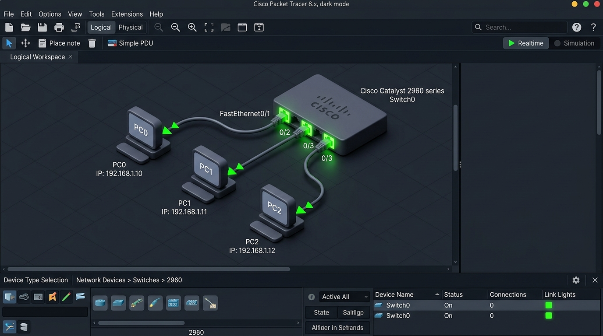

# 🧪 Day 01 Lab: Packet Tracer Introduction

Welcome to the **Cisco Packet Tracer Introduction Lab** guide! Ye worksheet aapko basic network topology set up karne aur local connections test karne ke steps pure Hinglish language mein samjhayega.

---

## 📝 1. Lab Overview & Topology
Is lab mein hum Cisco Packet Tracer ka basic user interface (UI) seekhenge aur ek simple local area network (LAN) topology banakar connectivity test karenge.

### Topology Components:
*   **Switch:** 1x Cisco 2960 Switch
*   **PCs:** 3x End Devices (PC0, PC1, PC2)
*   **Cabling:** 3x Copper Straight-Through Cables

### Logical Connection Path:
*   `PC0 (Fa0)` ---> `Switch (Fa0/1)`
*   `PC1 (Fa0)` ---> `Switch (Fa0/2)`
*   `PC2 (Fa0)` ---> `Switch (Fa0/3)`



---

## 🛠️ 2. Step-by-Step Lab Instructions

### Step 1: Place the Devices (Devices set up karein)
1.  Packet Tracer open karein.
2.  Left-bottom panel se **Network Devices -> Switches** select karein.
3.  **2960 Switch** select karke workspace par drag & drop karein.
4.  Left-bottom panel se **End Devices** select karein.
5.  **PC** select karke 3 PCs (PC0, PC1, PC2) workspace par lagayein.

### Step 2: Connect the Cables (Physical connection karein)
1.  Left-bottom panel se **Connections** (Orange lightning bolt icon) select karein.
2.  **Copper Straight-Through Cable** (solid black line) select karein.
3.  PC0 par click karke **FastEthernet0** port select karein.
4.  Cable ko Switch par le ja kar click karein aur **FastEthernet0/1** port select karein.
5.  Same steps follow karke:
    *   PC1 (FastEthernet0) ko Switch (FastEthernet0/2) se connect karein.
    *   PC2 (FastEthernet0) ko Switch (FastEthernet0/3) se connect karein.

### Step 3: Configure IP Addresses (Logical IP Settings)
1.  PC0 par double-click karein -> **Desktop** tab -> **IP Configuration** open karein.
2.  IPv4 Address set karein: `192.168.1.1`
3.  Subnet Mask box par click karein, ye automatically populate hoga: `255.255.255.0`
4.  Same method se:
    *   PC1 ko IP Address: `192.168.1.2` aur Subnet Mask: `255.255.255.0` assign karein.
    *   PC2 ko IP Address: `192.168.1.3` aur Subnet Mask: `255.255.255.0` assign karein.

### Step 4: Verify Connectivity (Ping Check)
1.  PC0 par double-click karein -> **Desktop** tab -> **Command Prompt** select karein.
2.  Pehle verify karein ki local IP settings sahi hain. Command run karein:
    ```cmd
    ipconfig
    ```
3.  PC1 ko ping karne ke liye command run karein:
    ```cmd
    ping 192.168.1.2
    ```
4.  PC2 ko ping karne ke liye command run karein:
    ```cmd
    ping 192.168.1.3
    ```
*   **Expected Output:** Aapko response milna chahiye: `Reply from 192.168.1.2: bytes=32 time<1ms TTL=128` (4 packets sent, 4 received, 0% loss).

---

## 💡 3. Key Concepts & Troubleshooting
*   🔴 **Red Link Light:** Physical layer disconnected hai (wrong cable selection ya switch port shut down state mein hai).
*   🟠 **Amber/Orange Link Light:** Port transition state mein hai. Cisco Switch ka protection protocol (**STP - Spanning Tree Protocol**) loop detection ke liye check kar raha hota hai. 30-50 seconds wait karein, ye automatically green ho jayega.
*   🟢 **Green Link Light:** Connection active aur data transfer ke liye ready hai.

---

## 📝 4. CCNA Day 01 Lab Practice Questions

Aap yahan questions ko read karke answers verify kar sakte hain (Answer dekhne ke liye click karein):

1.  **Q1: PC se Switch ko connect karne ke liye kis type ki copper cable ka use kiya jata hai?**
    <details>
    <summary>🔓 Click to Reveal Answer</summary>
    **Answer:** **Copper Straight-Through Cable** (Kyunki PC aur Switch alag logical layer categories ke devices hain).
    </details>

2.  **Q2: Packet Tracer workspace par devices ke ports connectivity line lagate hi temporary orange kyu dikhai deti hai?**
    <details>
    <summary>🔓 Click to Reveal Answer</summary>
    **Answer:** **STP (Spanning Tree Protocol)** active check run ho raha hota hai taaki local loop detection aur protection checking phase chalu ho sake.
    </details>

3.  **Q3: PC ko local network par IP configuration details verify karne ke liye console terminal par kaun si utility run karni padti hai?**
    <details>
    <summary>🔓 Click to Reveal Answer</summary>
    **Answer:** **ipconfig** command.
    </details>

4.  **Q4: Router to Router direct connection ke liye hume straight-through cable use karni chahiye ya crossover cable?**
    <details>
    <summary>🔓 Click to Reveal Answer</summary>
    **Answer:** **Crossover Cable** (Kyunki same L3 dynamic host devices connected hain).
    </details>

5.  **Q5: Do local devices ke beech configuration settings and network layer ping logic check karne ke liye default ICMP protocol kaun use karta hai?**
    <details>
    <summary>🔓 Click to Reveal Answer</summary>
    **Answer:** **ping** command.
    </details>

6.  **Q6: Packet Tracer ke kis workspace mein hum geographic mapping (building floor plan, wiring closet layout) load karte hain?**
    <details>
    <summary>🔓 Click to Reveal Answer</summary>
    **Answer:** **Physical Workspace**.
    </details>

7.  **Q7: Agar hum standard Crossover cable se switch-to-switch connect karein aur switch par Auto-MDIX enable ho, toh kya network chalega?**
    <details>
    <summary>🔓 Click to Reveal Answer</summary>
    **Answer:** **Yes, absolutely.** Auto-MDIX dynamic software automatic sensing se link lines switch kar dega aur data status pass ho jayega.
    </details>

8.  **Q8: Subnet Mask "255.255.255.0" kis IP Address Class ka standard default mask hai?**
    <details>
    <summary>🔓 Click to Reveal Answer</summary>
    **Answer:** **Class C** IP Addressing.
    </details>

9.  **Q9: FastEthernet0/1 interface hardware level par maximum kitni data transfer rate speed support karta hai?**
    <details>
    <summary>🔓 Click to Reveal Answer</summary>
    **Answer:** **100 Mbps** (Megabits per second).
    </details>

10. **Q10: Packet Tracer software tool ka main benefit (use-case) kya hai?**
    <details>
    <summary>🔓 Click to Reveal Answer</summary>
    **Answer:** Physical hardware cost aur cabling resources ke bina complex network topologies design, test, aur dynamically troubleshoot karna.
    </details>
