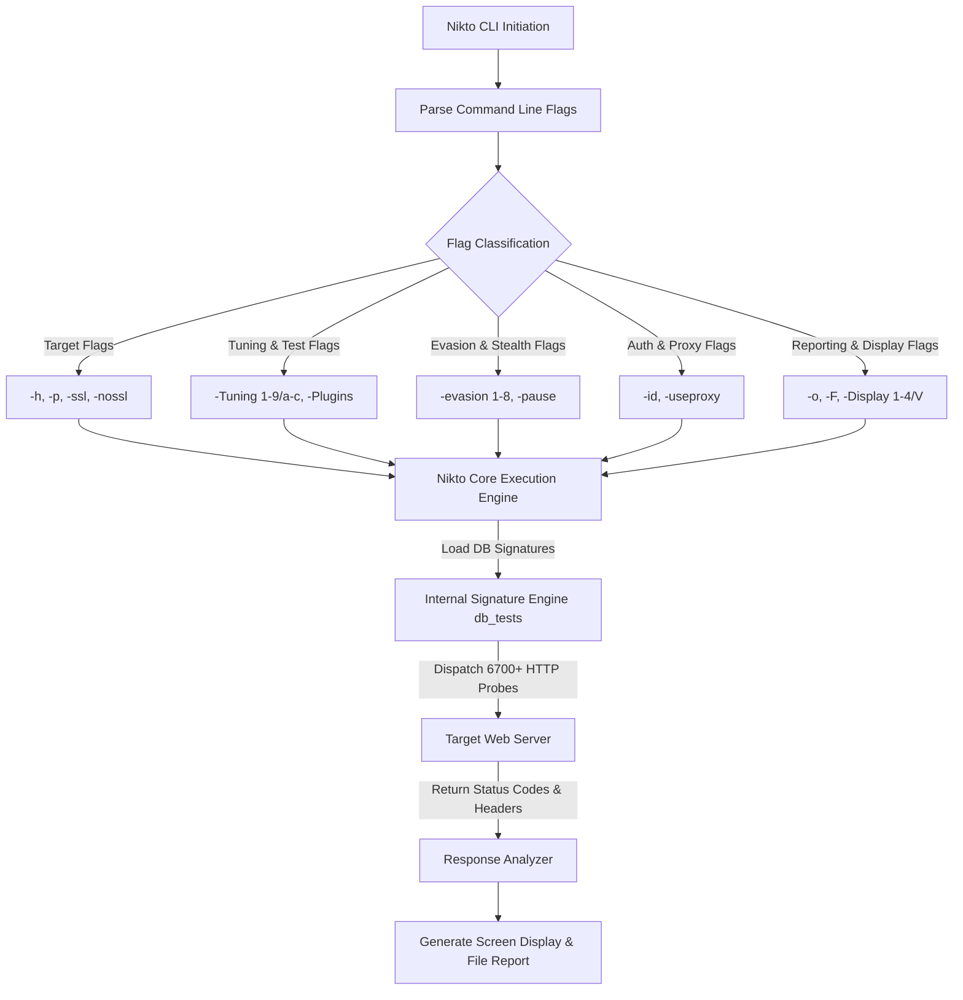

# Nikto Web Vulnerability Scanner - In-Depth Masterclass Guide

---

## 1. Deep Dive: What is Nikto & How It Operates Under the Hood

**Nikto** is an open-source web server scanner written in **Perl** by Chris Sullo and David Lodge. It is designed to perform comprehensive security audits against web servers to identify known security vulnerabilities, dangerous default files, insecure software versions, and configuration flaws.

### How Nikto Operates Internally:
1. **Signature Database Match:** Nikto relies on a set of database files stored inside `/var/lib/nikto/databases/` (such as `db_tests`, `db_variables`, `db_server_msgs`, `db_httpoptions`).
2. **HTTP Request Generation:** It crafts custom HTTP GET, POST, HEAD, and OPTIONS requests based on over 6,700 vulnerability checks.
3. **Response Analysis:** It analyzes the server's HTTP Response Headers (e.g., `Server`, `X-Powered-By`, `Location`), status codes (`200 OK`, `403 Forbidden`, `302 Found`), and response body content to detect vulnerabilities.

---

## 2. Nikto Scanning & Flag Processing Architecture



---

## 3. Exhaustive Flag-by-Flag Deep Breakdown

Below is a detailed breakdown of every single Nikto CLI flag, explaining **What it does**, **Why & When to use it**, **Exact Command Syntax**, and **Real Terminal Output Expectations**.

---

### 3.1 Target Specification Flags

#### 🔹 `-h` / `-host` (Target Specification)
* **Under the Hood:** Specifies the target host IP address, domain name, full URL, or path to a text file containing multiple targets.
* **Why Use It:** It is the mandatory primary flag required for every Nikto execution.
* **Command Example:**
  ```bash
  nikto -h 192.168.1.105
  nikto -h https://example.com
  nikto -h /home/kali/targets.txt
  ```

#### 🔹 `-p` / `-port` (Port Selection)
* **Under the Hood:** Specifies target port(s). Supports single ports (`8080`), multiple comma-separated ports (`80,443,8080`), or port ranges (`80-90`).
* **Command Example:**
  ```bash
  nikto -h 10.10.10.50 -p 8080,8443
  ```

#### 🔹 `-ssl` / `-nossl` (SSL/TLS Mode Control)
* **Under the Hood:** `-ssl` forces Nikto to initiate an SSL/TLS handshake (HTTPS) regardless of port. `-nossl` forces plain HTTP mode even on port 443.
* **Command Example:**
  ```bash
  nikto -h 10.10.10.50 -p 8443 -ssl
  ```

---

### 3.2 Scan Tuning & Customization Flags

#### 🔹 `-Tuning` (Scan Category Filtering)
* **Under the Hood:** Filters which database tests are run. Accepts single numbers/letters or combinations.
* **Tuning Categories Breakdown:**
  * `1`: **File Retrieval / Information Disclosure** (`/phpinfo.php`, `.git/`, `.env`, `.bak`).
  * `2`: **Default Files / Misconfigurations** (`/admin`, `/test`, `/dashboard`).
  * `3`: **Information Disclosure** (Leaks in server headers, banner grabbing).
  * `4`: **Injection** (Checks for Cross-Site Scripting / XSS flaws).
  * `5`: **Remote File Inclusion (RFI)** (Checks if server includes remote URLs).
  * `6`: **Denial of Service (DoS)** (Checks for known server crash vectors).
  * `7`: **Remote File Execution** (Command injection points).
  * `8`: **Reverse Shell / Command Execution** (Executes test commands).
  * `9`: **SQL Injection** (Probes parameters for SQL error responses).
  * `a`: **Authentication Bypass** (Attempts bypasses on login portals).
  * `b`: **Software Version Identification** (Checks banner against vulnerabilities).
  * `c`: **Source Code Disclosure** (Checks if raw code files are exposed).
  * `x`: **Exclusion Mode** (Excludes specified tests e.g. `-Tuning x6`).
* **Command Example:**
  ```bash
  nikto -h 10.10.10.50 -Tuning 129
  ```

---

### 3.3 Output, Proxy & Evasion Flags

* **`-o` / `-F` (Output File & Format):** `htm`, `csv`, `txt`, `xml`, `json`. Example: `nikto -h 10.10.10.50 -o report.html -F htm`
* **`-useproxy` (Proxy Tunneling):** Route through Burp Suite (`http://127.0.0.1:8080`). Example: `nikto -h 10.10.10.50 -useproxy http://127.0.0.1:8080`
* **`-id` (HTTP Basic Auth):** Example: `nikto -h http://target.thm/admin/ -id admin:Password123`
* **`-evasion` (WAF / IDS Bypass 1-8):** Example: `nikto -h 10.10.10.50 -evasion 12`
* **`-maxtime` & `-pause` (Speed & Time Limit):** Example: `nikto -h 10.10.10.50 -pause 2 -maxtime 30m`

---

## 🎯 10 Detailed Hands-On Practical Scenario Questions & Solutions

1. **Task 1 (Custom Port):** `nikto -h 192.168.56.101 -p 8088`
2. **Task 2 (HTTPS CSV Export):** `nikto -h dev-portal.internal -p 4433 -ssl -o /home/kali/dev_report.csv -F csv`
3. **Task 3 (Selective Tuning):** `nikto -h 10.10.10.25 -Tuning 2a`
4. **Task 4 (Basic Auth):** `nikto -h http://10.10.10.50/manager/html -id tomcat:s3cretpassword`
5. **Task 5 (Burp Suite Proxy):** `nikto -h http://192.168.1.200 -useproxy http://127.0.0.1:8080`
6. **Task 6 (Batch Scanning):** `nikto -h /home/kali/web_servers.txt`
7. **Task 7 (Pause & Max Time):** `nikto -h http://legacy.target.local -pause 3 -maxtime 30m`
8. **Task 8 (WAF Evasion):** `nikto -h http://10.10.10.50 -evasion 12`
9. **Task 9 (Plugin Update):** `nikto -Version`, `nikto -list-plugins`, `nikto -update`
10. **Task 10 (Manual Verification):** `curl -s http://target.thm/config/db.json | jq .`
