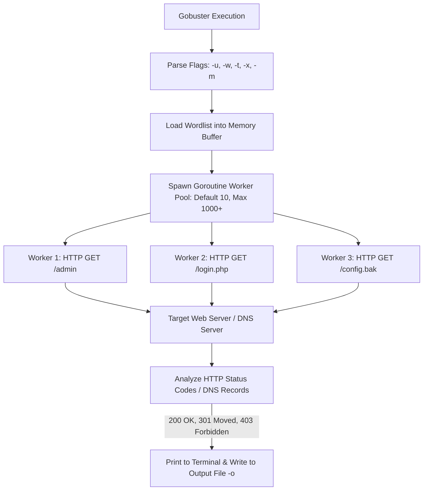

# Gobuster - In-Depth Masterclass Guide (Complete & Exhaustive)

---

## 1. Deep Dive: What is Gobuster & How It Operates Under the Hood

**Gobuster** is an extremely fast, multi-threaded open-source reconnaissance tool written in **Go (Golang)** by OJ Reeves (@TheColonial). It is used by penetration testers, Red Teams, and security researchers to perform brute-force discovery of:
- Hidden URI paths (Directories and Files) on web servers
- DNS Subdomains
- Virtual Hosts (Vhosts) on single IP addresses
- Amazon S3 Buckets
- URL Parameters (Fuzzing)

### Why Gobuster is Extremely Fast (Golang Concurrency Engine):
Unlike traditional scanning tools written in Python or Perl (such as DirB or Nikto) which execute sequentially or rely on heavy OS threads, Gobuster utilizes **Go Goroutines**. 

Goroutines are lightweight user-space threads managed directly by the Go runtime scheduler. This allows Gobuster to open hundreds of concurrent TCP sockets/HTTP requests per second with minimal CPU and RAM consumption.



---

## 2. Exhaustive Flag-by-Flag Deep Breakdown Across All Modes

Below is the complete, untruncated breakdown of **EVERY SINGLE CLI FLAG** in Gobuster, categorized by mode.

---

### 2.1 Global Flags (Applicable to All Modes)

#### 🔹 `-w` / `--wordlist` (Wordlist Selection)
* **Under the Hood:** Loads the specified wordlist file line-by-line into memory buffers.
* **Why & When to Use:** Mandatory for every scan. Standard wordlists on Kali Linux include:
  * `/usr/share/wordlists/dirb/common.txt` (Small & Fast)
  * `/usr/share/wordlists/dirbuster/directory-list-2.3-medium.txt` (Standard Pentest)
  * `/usr/share/wordlists/secLists/Discovery/Web-Content/big.txt` (Exhaustive)
* **Command Example:**
  ```bash
  gobuster dir -u http://10.10.10.50 -w /usr/share/wordlists/dirb/common.txt
  ```

#### 🔹 `-t` / `--threads` (Thread Pool Count)
* **Under the Hood:** Controls how many concurrent Goroutines are spawned to send requests. Default is `10`.
* **Why & When to Use:** Increase to `50` or `100` for high-speed local CTFs / lab machines. Decrease to `5` or `10` on fragile production servers.
* **Command Example:**
  ```bash
  gobuster dir -u http://10.10.10.50 -w /usr/share/wordlists/dirb/common.txt -t 50
  ```

#### 🔹 `-o` / `--output` (Output Log File)
* **Under the Hood:** Writes screen output directly to a designated text file on disk.
* **Why & When to Use:** Crucial for documenting pentest evidence and parsing findings.
* **Command Example:**
  ```bash
  gobuster dir -u http://10.10.10.50 -w /usr/share/wordlists/dirb/common.txt -o /tmp/gobuster_scan.txt
  ```

#### 🔹 `--delay` (Rate-Limiting Control)
* **Under the Hood:** Adds a sleep timer (e.g. `500ms`, `1s`) between each Goroutine request.
* **Why & When to Use:** Used to evade Web Application Firewall (WAF) rate limits and prevent IP bans.
* **Command Example:**
  ```bash
  gobuster dir -u http://10.10.10.50 -w /usr/share/wordlists/dirb/common.txt --delay 500ms
  ```

---

### 2.2 Directory & File Brute-Forcing Mode (`gobuster dir`)

Directory mode tests URI paths against web servers to discover hidden endpoints.

#### 🔹 `-u` / `--url` (Target Base URL)
* **Under the Hood:** Sets the root target HTTP/HTTPS destination URL.
* **Command Example:**
  ```bash
  gobuster dir -u http://10.10.10.50
  ```

#### 🔹 `-x` / `--extensions` (File Extension Appending)
* **Under the Hood:** Takes a comma-separated list of extensions (`php,html,txt,json,bak,zip`) and appends them to every word in the wordlist. For example, if word is `admin`, Gobuster tests `/admin`, `/admin.php`, `/admin.html`, `/admin.txt`, `/admin.bak`.
* **Why & When to Use:** Essential for finding hidden source code files, backup files, and API endpoints.
* **Command Example:**
  ```bash
  gobuster dir -u http://10.10.10.50 -w /usr/share/wordlists/dirb/common.txt -x php,html,txt,bak
  ```

#### 🔹 `-s` / `--status-codes` (Positive Status Code Filter)
* **Under the Hood:** Specifies which HTTP response codes to display in the terminal. Default is `200,204,301,302,307,401,403`.
* **Command Example:**
  ```bash
  gobuster dir -u http://10.10.10.50 -w /usr/share/wordlists/dirb/common.txt -s 200,301,403
  ```

#### 🔹 `-b` / `--status-codes-blacklisted` (Blacklist Status Codes)
* **Under the Hood:** Hides specific HTTP status codes (e.g. `404`, `500`).
* **Command Example:**
  ```bash
  gobuster dir -u http://10.10.10.50 -w /usr/share/wordlists/dirb/common.txt -b 404,500
  ```

#### 🔹 `-k` / `--insecure` (Skip SSL Certificate Validation)
* **Under the Hood:** Instructs the HTTPS client engine to skip TLS certificate verification.
* **Why & When to Use:** Essential when scanning internal lab targets using self-signed, invalid, or expired SSL certificates.
* **Command Example:**
  ```bash
  gobuster dir -u https://192.168.1.150 -w /usr/share/wordlists/dirb/common.txt -k
  ```

#### 🔹 `-c` / `--cookies` (HTTP Session Cookie Injection)
* **Under the Hood:** Appends a `Cookie: <value>` header to every HTTP probe sent.
* **Why & When to Use:** Used to perform authenticated directory scanning inside portals requiring active login sessions.
* **Command Example:**
  ```bash
  gobuster dir -u http://10.10.10.50/dashboard/ -w /usr/share/wordlists/dirb/common.txt -c "PHPSESSID=9a8b7c6d5e4f3210"
  ```

#### 🔹 `-H` / `--headers` (Custom HTTP Header Injection)
* **Under the Hood:** Injects arbitrary custom HTTP headers into requests (e.g. `Authorization`, `X-Forwarded-For`).
* **Command Example:**
  ```bash
  gobuster dir -u http://api.target.thm -w /usr/share/wordlists/dirb/common.txt -H "Authorization: Bearer my_secret_token"
  ```

#### 🔹 `--proxy` (HTTP Proxy Tunneling)
* **Under the Hood:** Routes all HTTP request traffic through an upstream HTTP proxy like **Burp Suite** (`http://127.0.0.1:8080`).
* **Why & When to Use:** Enables pentesting analysts to inspect raw Gobuster probes in Burp's HTTP history tab.
* **Command Example:**
  ```bash
  gobuster dir -u http://10.10.10.50 -w /usr/share/wordlists/dirb/common.txt --proxy http://127.0.0.1:8080
  ```

#### 🔹 `--exclude-length` (Response Byte Length Filter)
* **Under the Hood:** Drops responses whose body byte size matches specified numbers (e.g. `--exclude-length 512,314`).
* **Why & When to Use:** Used to eliminate wildcard false positives where custom 404 pages return `200 OK` with identical file sizes.
* **Command Example:**
  ```bash
  gobuster dir -u http://10.10.10.50 -w /usr/share/wordlists/dirb/common.txt --exclude-length 512
  ```

#### 🔹 `-r` / `--follow-redirect` (Follow HTTP Redirects)
* **Under the Hood:** Automatically follows HTTP 301/302 redirects to their final destination location.
* **Command Example:**
  ```bash
  gobuster dir -u http://10.10.10.50 -w /usr/share/wordlists/dirb/common.txt -r
  ```

---

### 2.3 DNS Subdomain Brute-Forcing Mode (`gobuster dns`)

DNS mode attempts to resolve subdomains against a target root domain.

#### 🔹 `-d` / `--domain` (Target Root Domain)
* **Command Example:** `gobuster dns -d target.thm -w /usr/share/wordlists/secLists/Discovery/DNS/subdomains-top1million-5000.txt`

#### 🔹 `-i` / `--show-ips` (Show Resolved IP Addresses)
* **Under the Hood:** Resolves A records and prints target IP addresses next to found subdomains in terminal output.
* **Command Example:** `gobuster dns -d target.thm -w subdomains.txt -i`

#### 🔹 `-r` / `--resolver` (Custom DNS Resolver IP)
* **Under the Hood:** Bypasses local system DNS (`/etc/resolv.conf`) and sends queries directly to specified DNS servers (e.g. `1.1.1.1` or internal Domain Controller IP `10.10.10.1`).
* **Command Example:** `gobuster dns -d target.thm -w subdomains.txt -r 10.10.10.1`

---

### 2.4 Virtual Host Brute-Forcing Mode (`gobuster vhost`)

Vhost mode audits HTTP `Host:` header routing on single IP servers hosting multiple domain names.

#### 🔹 `--append-domain` (Append Domain to Subdomains)
* **Under the Hood:** Takes wordlist entries (`admin`, `dev`) and appends root domain (`target.thm`) creating `Host: admin.target.thm`.
* **Command Example:**
  ```bash
  gobuster vhost -u http://10.10.10.100 -w /usr/share/wordlists/secLists/Discovery/DNS/subdomains-top1million-5000.txt --append-domain
  ```

---

### 2.5 Custom Parameter Fuzzing Mode (`gobuster fuzz`)

Fuzz mode replaces the `FUZZ` placeholder anywhere in target URLs or headers.

#### 🔹 `FUZZ` Keyword Replacement
* **Command Example:**
  ```bash
  gobuster fuzz -u "http://target.thm/view.php?id=FUZZ" -w /home/kali/numbers.txt -b 404
  ```

---

## 3. Real-World Practical Examples & Commands

### Example 1: Full Web Directory & Backup File Scan
```bash
gobuster dir -u http://10.10.10.50 -w /usr/share/wordlists/dirb/common.txt -x php,html,txt,json,bak,zip -t 50 -o /tmp/dir_results.txt
```

### Example 2: Subdomain Enumeration Displaying IP Addresses
```bash
gobuster dns -d target.thm -w /usr/share/wordlists/secLists/Discovery/DNS/subdomains-top1million-5000.txt -i -t 50
```

### Example 3: Authenticated Scanning Behind Burp Suite Proxy
```bash
gobuster dir -u http://10.10.10.50/admin/ -w /usr/share/wordlists/dirb/common.txt -c "PHPSESSID=abcdef123456" --proxy http://127.0.0.1:8080
```

---

## 🎯 10 Detailed Hands-On Practical Questions & Terminal Walkthrough Solutions

---

### ❓ Task 1 (Directory Scan with Extensions)
**Scenario:** Target IP `10.10.14.33` par directory scan chalayein. Wordlist `/usr/share/wordlists/dirb/common.txt` use karein aur Extensions `.php`, `.html`, aur `.bak` check karein. Thread count `50` specify karein.
* **Solution Command:**
  ```bash
  gobuster dir -u http://10.10.14.33 -w /usr/share/wordlists/dirb/common.txt -x php,html,bak -t 50
  ```
* **Detailed Walkthrough:** `dir` mode URL paths brute-force karta hai. `-x php,html,bak` extensions append karke `/admin.php` ya `/config.bak` jaise hidden scripts dhundta hai. `-t 50` 50 concurrent Goroutines spawn karta hai.

---

### ❓ Task 2 (Self-Signed SSL Warning Bypass)
**Scenario:** Target `https://192.168.1.150` par self-signed SSL certificate laga hai jiski wajah se Gobuster TLS handshake error de raha hai. Certificate warnings ignore karke scan chalayein.
* **Solution Command:**
  ```bash
  gobuster dir -u https://192.168.1.150 -w /usr/share/wordlists/dirb/common.txt -k
  ```
* **Detailed Walkthrough:** `-k` / `--insecure` flag Go ke HTTPS client engine ko instruction deta hai ki certificate verification check bypass kar de, jisse local labs ya internal servers bin kisi error ke scan ho jate hain.

---

### ❓ Task 3 (Subdomain Discovery with IP Resolution)
**Scenario:** Domain `acme.thm` ke subdomains wordlist `/usr/share/wordlists/secLists/Discovery/DNS/subdomains-top1million-5000.txt` se discover karein aur terminal output mein resolved IP addresses bhi show karein.
* **Solution Command:**
  ```bash
  gobuster dns -d acme.thm -w /usr/share/wordlists/secLists/Discovery/DNS/subdomains-top1million-5000.txt -i
  ```
* **Detailed Walkthrough:** `dns` mode DNS A record queries bhejta hai. `-i` flag discovered hostname ke aage target IP address (`10.10.10.5`) display karta hai.

---

### ❓ Task 4 (Authenticated Directory Scan via Session Cookie)
**Scenario:** Target site `http://target.thm` par login ke baad session cookie mili: `PHPSESSID=9a8b7c6d5e4f3210`. Authenticated directories scan karein.
* **Solution Command:**
  ```bash
  gobuster dir -u http://target.thm -w /usr/share/wordlists/dirb/common.txt -c "PHPSESSID=9a8b7c6d5e4f3210"
  ```
* **Detailed Walkthrough:** `-c` flag `Cookie: PHPSESSID=9a8b7c6d5e4f3210` HTTP header inject karta hai jisse web server scanner ko active user treat karta hai aur internal dashboard paths (`/user/profile`) disclose ho jate hain.

---

### ❓ Task 5 (Virtual Host / Vhost Discovery)
**Scenario:** Target IP `10.10.10.100` par main domain `corp.thm` ke internal vhosts brute-force karne ki command likhein.
* **Solution Command:**
  ```bash
  gobuster vhost -u http://10.10.10.100 -w /usr/share/wordlists/secLists/Discovery/DNS/subdomains-top1million-5000.txt --append-domain
  ```
* **Detailed Walkthrough:** `vhost` mode target IP par `Host: dev.corp.thm`, `Host: internal.corp.thm` headers send karta hai to reveal hidden virtual routing.

---

### ❓ Task 6 (Routing Gobuster Traffic Through Burp Suite Proxy)
**Scenario:** Gobuster ke saare HTTP requests ko Burp Suite proxy (`http://127.0.0.1:8080`) ke through route karke log karne ki command likhein.
* **Solution Command:**
  ```bash
  gobuster dir -u http://10.10.10.50 -w /usr/share/wordlists/dirb/common.txt --proxy http://127.0.0.1:8080
  ```
* **Detailed Walkthrough:** `--proxy` flag local HTTP proxy server par saara traffic route karta hai taaki pentester raw request/response pairs Burp Suite mein analyze kar sake.

---

### ❓ Task 7 (Filtering Wildcard False Positive Lengths)
**Scenario:** Target web server par wildcard redirect chal raha hai jo har non-existent URL par 200 OK aur exact `512` bytes response body length deta hai. Length 512 ko filter out karke scan chalayein.
* **Solution Command:**
  ```bash
  gobuster dir -u http://10.10.10.50 -w /usr/share/wordlists/dirb/common.txt --exclude-length 512
  ```
* **Detailed Walkthrough:** `--exclude-length 512` byte length 512 wale responses ko terminal se drop kar deta hai, jisse wildcard false positives clean ho jate hain.

---

### ❓ Task 8 (Parameter Fuzzing with FUZZ Keyword)
**Scenario:** Target URL `http://target.thm/view.php?id=FUZZ` par URL parameter brute-force karein numerical wordlist `/home/kali/numbers.txt` se aur 404 response codes ignore karein.
* **Solution Command:**
  ```bash
  gobuster fuzz -u "http://target.thm/view.php?id=FUZZ" -w /home/kali/numbers.txt -b 404
  ```
* **Detailed Walkthrough:** `fuzz` mode `FUZZ` placeholder ko numbers (`id=1`, `id=2`, `id=3`) se replace karta hai to identify IDOR / Parameter Tampering bugs.

---

### ❓ Task 9 (Stealth Scanning with Request Delay)
**Scenario:** Target WAF detection se bachane ke liye Gobuster mein har request ke beech **500ms (0.5 second) ka delay** rakhein aur thread count **5** specify karein.
* **Solution Command:**
  ```bash
  gobuster dir -u http://10.10.10.50 -w /usr/share/wordlists/dirb/common.txt -t 5 --delay 500ms
  ```
* **Detailed Walkthrough:** `-t 5` thread count kam karta hai aur `--delay 500ms` har request ke baad pause deta hai taaki WAF rate-limiting rules trigger na hon.

---

### ❓ Task 10 (Custom Bearer Header & Output File Logging)
**Scenario:** Target API `http://api.target.thm/v1` par Custom Bearer Token Header `Authorization: Bearer my_secret_token_123` bhejkar scan result ko `/home/kali/api_dirs.txt` file mein save karein.
* **Solution Command:**
  ```bash
  gobuster dir -u http://api.target.thm/v1 -w /usr/share/wordlists/dirb/common.txt -H "Authorization: Bearer my_secret_token_123" -o /home/kali/api_dirs.txt
  ```
* **Detailed Walkthrough:** `-H` custom authentication headers inject karta hai aur `-o` scan result file par write kar deta hai.
