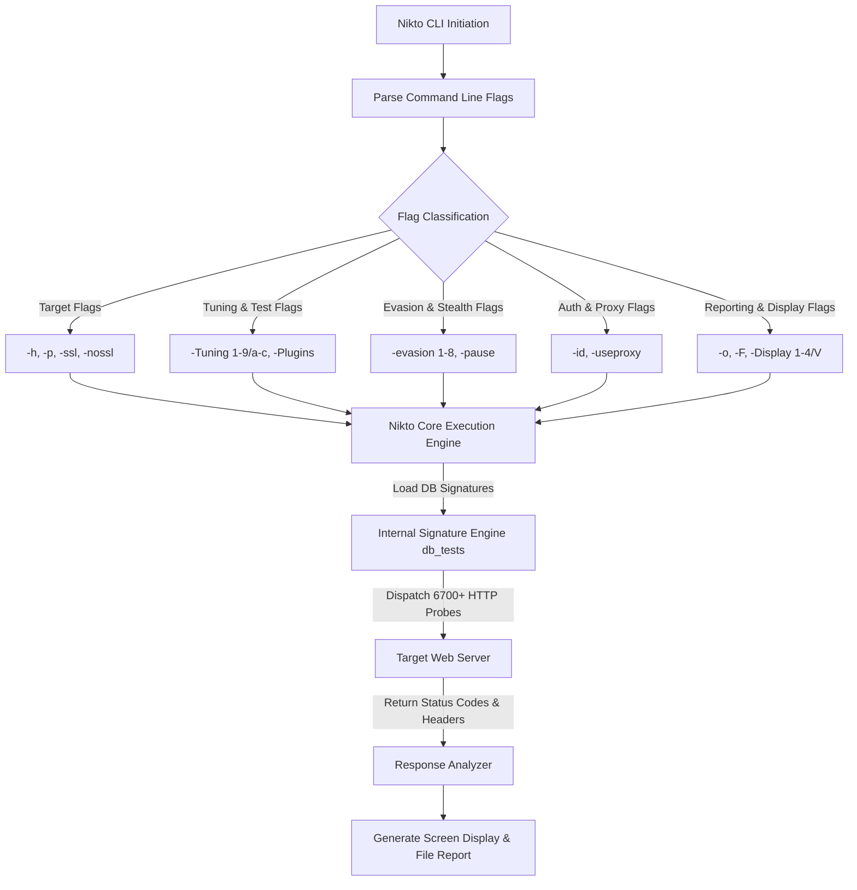

# Nikto Web Vulnerability Scanner - In-Depth Masterclass Guide

---

## 1. Deep Dive: What is Nikto & How It Operates Under the Hood

**Nikto** is an open-source web server scanner written in **Perl** by Chris Sullo and David Lodge. It is designed to perform comprehensive security audits against web servers to identify known security vulnerabilities, dangerous default files, insecure software versions, and configuration flaws.

### How Nikto Operates Internally:
1. **Signature Database Match:** Nikto relies on a set of database files stored inside `/var/lib/nikto/databases/` (such as `db_tests`, `db_variables`, `db_server_msgs`, `db_httpoptions`).
2. **HTTP Request Generation:** It crafts custom HTTP GET, POST, HEAD, and OPTIONS requests based on over 6,700 vulnerability checks.
3. **Response Analysis:** It analyzes the server's HTTP Response Headers (e.g., `Server`, `X-Powered-By`, `Location`), status codes (`200 OK`, `403 Forbidden`, `302 Found`), and response body content to detect vulnerabilities.

---

## 2. Nikto Scanning & Flag Processing Architecture

---

## 3. Exhaustive Flag-by-Flag Deep Breakdown

### 3.1 Target Specification Flags
* **`-h` / `-host`:** Target host IP, domain name, full URL, or target file (`nikto -h 192.168.1.105`).
* **`-p` / `-port`:** Target port number (`nikto -h 10.10.10.50 -p 8080`).
* **`-ssl` / `-nossl`:** Force SSL/TLS mode (`nikto -h 10.10.10.50 -p 8443 -ssl`).

### 3.2 Scan Tuning Flags
* **`-Tuning`:** Scan test categories (1: Files, 2: Misconfig, 3: Headers, 4: XSS, 5: RFI, 6: DoS, 7: Command Injection, 8: Reverse Shell, 9: SQLi, a: Auth Bypass, b: Software Version, c: Source Code). Example: `nikto -h 10.10.10.50 -Tuning 129`.

### 3.3 Output, Proxy & Evasion Flags
* **`-o` / `-F`:** Report path & format (`nikto -h 10.10.10.50 -o report.html -F htm`).
* **`-useproxy`:** Intercept via Burp Suite (`nikto -h 10.10.10.50 -useproxy http://127.0.0.1:8080`).
* **`-id`:** Basic HTTP Auth credentials (`nikto -h http://target.thm/admin/ -id admin:Password123`).
* **`-evasion`:** WAF/IDS bypass techniques 1-8 (`nikto -h 10.10.10.50 -evasion 12`).
* **`-maxtime` & `-pause`:** Speed & timeout control (`nikto -h 10.10.10.50 -pause 2 -maxtime 30m`).

---

## 🎯 10 Detailed Hands-On Practical Scenario Questions & Solutions

1. **Task 1:** `nikto -h 192.168.56.101 -p 8088`
2. **Task 2:** `nikto -h dev-portal.internal -p 4433 -ssl -o /home/kali/dev_report.csv -F csv`
3. **Task 3:** `nikto -h 10.10.10.25 -Tuning 2a`
4. **Task 4:** `nikto -h http://10.10.10.50/manager/html -id tomcat:s3cretpassword`
5. **Task 5:** `nikto -h http://192.168.1.200 -useproxy http://127.0.0.1:8080`
6. **Task 6:** `nikto -h /home/kali/web_servers.txt`
7. **Task 7:** `nikto -h http://legacy.target.local -pause 3 -maxtime 30m`
8. **Task 8:** `nikto -h http://10.10.10.50 -evasion 12`
9. **Task 9:** `nikto -Version`, `nikto -list-plugins`, `nikto -update`
10. **Task 10:** `curl -s http://target.thm/config/db.json | jq .`
